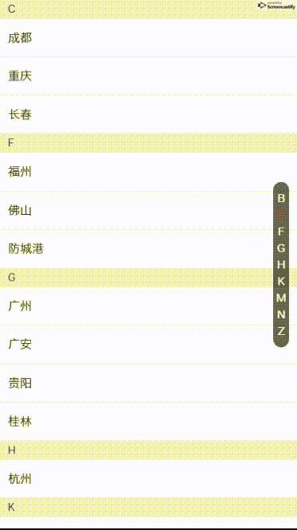

# vue-alphabet-sort

## Introduction
基于VueJs 2.0开发的仿手机联系人选择组件

## Usage

```
npm install --save vue-alphabet-sort

import alphabetSortList from 'vue-alphabet-sort'
Vue.use(alphabetSortList)

<alphabet-sort-list
    :list="data"
    @itemClick="itemClickHandle">
</alphabet-sort-list>
```

## Demo



## Props
名称|类型|必选|默认值|说明
---|:---:|---:|---:|---:
list | Array | false | [] | 选择项数据
labelKey | String | false | label | 名称字段名
valueKey | String | false | value | 值字段名
activeColor | String | false | #DD3629 | 焦点颜色

## Events

事件名称|说明|回调参数
---|:---:|---:
itemClick | 点击选项时触发 | 点击项对应的Object

## 数据格式

```
data:[
    {
        name: 'B',
        list: [
            {
                label: '北京',
                value: 10000
            },
            {
                label: '北海',
                value: 10000
            }
        ]
    },
    {
        name: 'C',
        list: [
            {
                label: '成都',
                value: 10000
            },
            {
                label: '重庆',
                value: 10000
            },
            {
                label: '长春',
                value: 10000
            }
        ]
    }
]

```